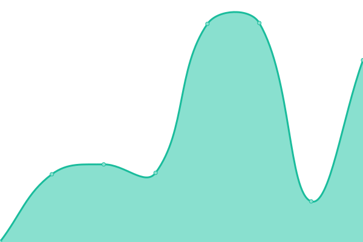

# [📈 Live Status](https://uptime.st37.fr): <!--live status--> **🟧 Partial outage**

This repository contains the open-source uptime monitor and status page for [ST37 - infra](https://uptime.st37.fr), powered by [Upptime](https://github.com/upptime/upptime).

With [Upptime](https://upptime.js.org), you can get your own unlimited and free uptime monitor and status page, powered entirely by a GitHub repository. We use [Issues](https://github.com/st37infra/upptime/issues) as incident reports, [Actions](https://github.com/st37infra/upptime/actions) as uptime monitors, and [Pages](https://uptime.st37.fr) for the status page.

<!--start: status pages-->
<!-- This summary is generated by Upptime (https://github.com/upptime/upptime) -->
<!-- Do not edit this manually, your changes will be overwritten -->
<!-- prettier-ignore -->
| URL | Status | History | Response Time | Uptime |
| --- | ------ | ------- | ------------- | ------ |
|  [ST37 Home](https://www.st37.fr) | 🟩 Up | [st-37-home.yml](https://github.com/st37infra/upptime/commits/HEAD/history/st-37-home.yml) | 

 2098ms
     
 | 

<a href="https://uptime.st37.fr/history/st-37-home">100.00%</a>
    

|  [ST37 Skouting](https://skouting.st37.fr) | 🟩 Up | [st-37-skouting.yml](https://github.com/st37infra/upptime/commits/HEAD/history/st-37-skouting.yml) | 

 136ms
     
 | 

<a href="https://uptime.st37.fr/history/st-37-skouting">100.00%</a>
    

|  [ST37 Engarde Service](https://engarde-service.com) | 🟩 Up | [st-37-engarde-service.yml](https://github.com/st37infra/upptime/commits/HEAD/history/st-37-engarde-service.yml) | 

 795ms
     
 | 

<a href="https://uptime.st37.fr/history/st-37-engarde-service">100.00%</a>
    

|  [ST37 Engarde Escrime](https://www.engarde-escrime.com) | 🟩 Up | [st-37-engarde-escrime.yml](https://github.com/st37infra/upptime/commits/HEAD/history/st-37-engarde-escrime.yml) | 

 996ms
     
 | 

<a href="https://uptime.st37.fr/history/st-37-engarde-escrime">100.00%</a>
    

|  [ST37 Paasport](https://www.paasport.st37.fr) | 🟩 Up | [st-37-paasport.yml](https://github.com/st37infra/upptime/commits/HEAD/history/st-37-paasport.yml) | 

 640ms
     
 | 

<a href="https://uptime.st37.fr/history/st-37-paasport">99.82%</a>
    

|  [ST37 Skouting Industrie](https://www.industrie.st37.fr) | 🟩 Up | [st-37-skouting-industrie.yml](https://github.com/st37infra/upptime/commits/HEAD/history/st-37-skouting-industrie.yml) | 

 930ms
     
 | 

<a href="https://uptime.st37.fr/history/st-37-skouting-industrie">99.82%</a>
    

|  [ST37 AI Prod](52.211.208.47) | 🟥 Down | [st-37-ai-prod.yml](https://github.com/st37infra/upptime/commits/HEAD/history/st-37-ai-prod.yml) | 

 0ms
     
 | 

<a href="https://uptime.st37.fr/history/st-37-ai-prod">0.00%</a>
    

|  [ST37 AI Dev](dev-aist.st37.fr) | 🟩 Up | [st-37-ai-dev.yml](https://github.com/st37infra/upptime/commits/HEAD/history/st-37-ai-dev.yml) | 

 104ms
     
 | 

<a href="https://uptime.st37.fr/history/st-37-ai-dev">89.26%</a>
    

<!--end: status pages-->

[**Visit our status website →**](https://uptime.st37.fr)

## 📄 License

- Powered by: [Upptime](https://github.com/upptime/upptime)
- Code: [MIT](./LICENSE) © [ST37 - infra](https://uptime.st37.fr)
- Data in the `./history` directory: [Open Database License](https://opendatacommons.org/licenses/odbl/1-0/)
